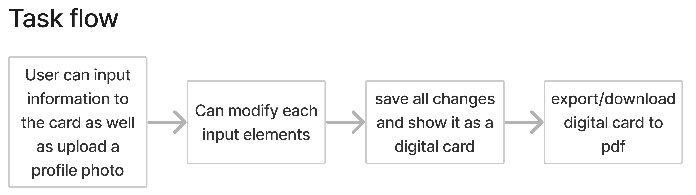
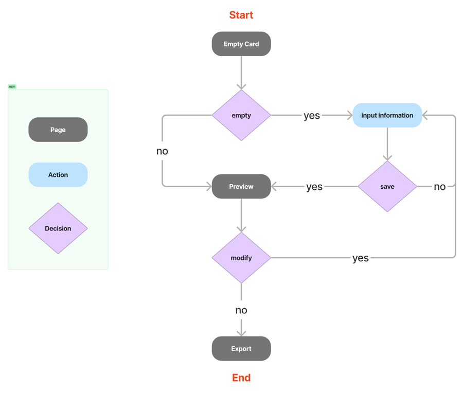
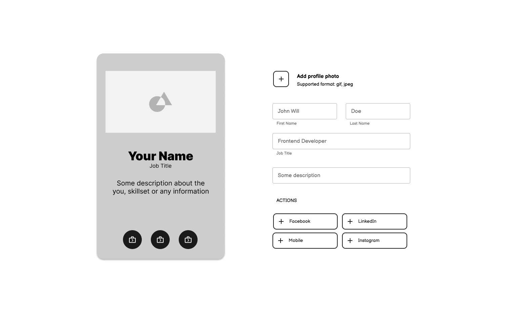
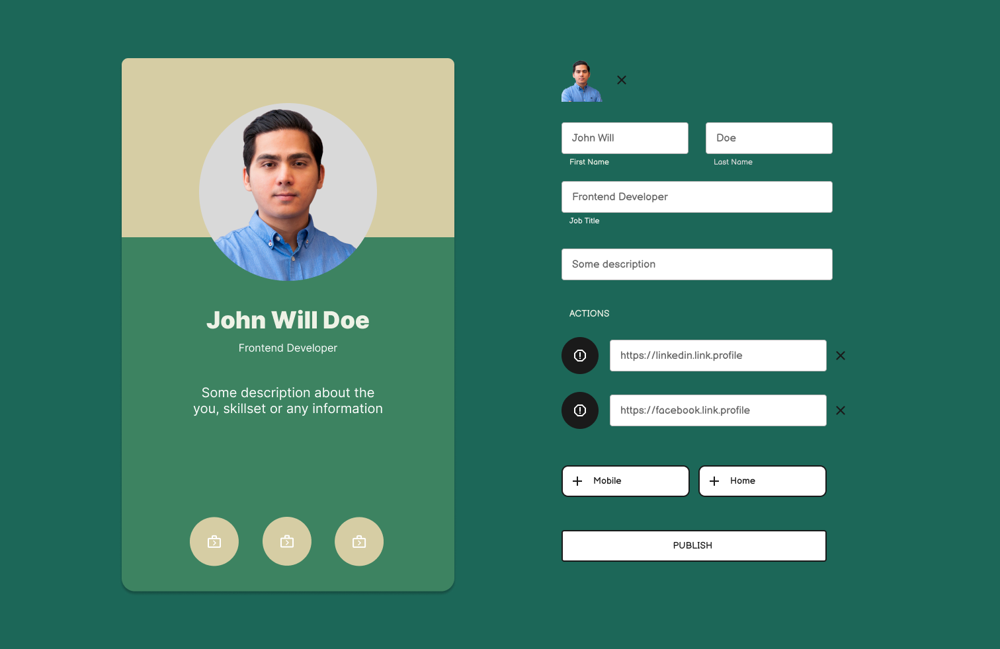
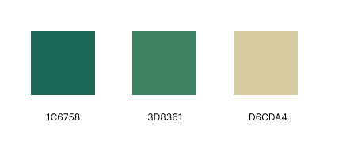
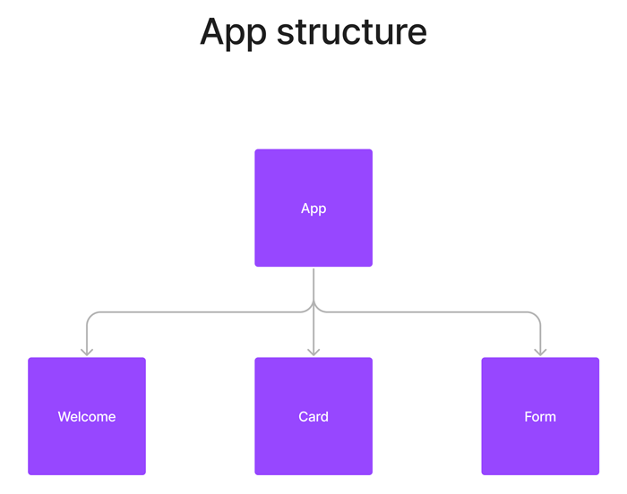

The best way to learn and understand is to  actualy be hands-on. 

Here I decided to create an app where it lets you create a digital card.
The goal is to understand React JS, its components and state management as well as establish a structured workflow from ideation to production.

## How does it work?

The app lets you input your information in the form and display it in the 
digital card template. You are also able to upload a profile photo, add and modify
the your input.

## What are the steps involved in creating this project?

Before I could come up build the idea of a digital card maker, I had to go through a design process
so that I could clearly defined how the project should function and look like.

### Ideation

I started by defining a User Story to help me shape the goal of the application I want to build.

#### User Story
> Liza wants to create a digital card wher she can share general information about her
to her clients. She would like to also be able to enter information herself and modify
the digital card anytime she wants.
>

#### Task Flow

Defined a user's jorney through tasks.

#### User Flow

Defined the specific patch of how the user would be using the application.

### Wireframe

Once I have finalized the design process, I used figma and started creating a wireframe on how the 
app could potentially look like.

### Design

Now it is time to create a high fidelity prototype. I created a new page in **Figma** added some placeholder
information.

I also chose these colors to make it look pleasing and modern.

### Development

Now that I have a clear view on how the App should look like, it is time to bring it to life.

First I went back in using Figma and define the structure of the app's components. This way it will be organized
and helps to be more structured during development.

Before actually starting to code, I challenged myself to try out the **Test Driven Development** approach with this project.
Since I decided to build this project with **React**, I used the `React Testing Library` to write the tests that simulate how the user would use the application.

Finally, here's the link to the github repository of the project, [manfredwern/digicard](https://github.com/manfredwern/digicard)

